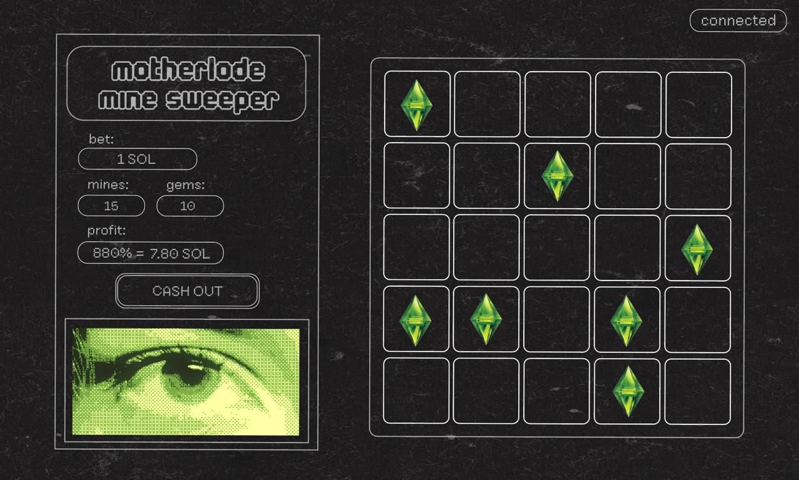

# Project Proposal: Telegram Minesweeper Gambling Game

## Project Overview

A stylized minesweeper-themed gambling game accessible via a Telegram bot, using Solana blockchain for transactions. The game serves as a community engagement tool for an upcoming meme coin launch, with proceeds supporting the project treasury and rewarding token holders.

## Core Gameplay Mechanics

1. **Bet Placement**: Player selects bet amount (in Solana) and number of mines to place on the field
2. **Game Progression**: Player clicks tiles to reveal "green diamonds" (safe tiles), with each successful click multiplying their potential winnings
3. **Win Conditions**:
   - Player can cash out at any time to claim accumulated winnings
   - Hitting a mine results in losing the entire bet
4. **Multiplier System**: Earnings multiply based on:
   - Number of mines selected at game start (higher risk = higher rewards)
   - Number of safe tiles successfully revealed

## Technical Architecture

### Platform Implementation: Telegram Bot + Web App (Hybrid Approach)

The game will use a **Telegram bot with inline button launch pattern**, similar to existing bots like @PoopoovilleBot. This approach provides the best balance of Telegram integration and Solana blockchain compatibility.

**How it works:**

1. User interacts with the Telegram bot via commands (e.g., `/play`, `/deposit`, `/withdraw`)
2. Bot responds with an inline button (e.g., "🎮 Open Game")
3. Button opens a full-screen React web app in Telegram's in-app browser
4. Web app connects to Solana wallets (Phantom, Solflare, etc.) for all blockchain transactions
5. All game logic and betting happens in the web app

**Why this approach:**

- ✅ Maintains Telegram's 950M+ user distribution advantage
- ✅ Allows use of Solana blockchain (not restricted by TON exclusivity policy)
- ✅ Standard Solana wallet integration (Phantom, Solflare)
- ✅ Simpler than true Telegram Mini Apps (less platform-specific code)
- ✅ No policy violations - web apps opened via buttons are not subject to TON Connect requirements
- ✅ Full-screen game canvas with professional UX

### Technology Stack

**Bot Layer:**

- Node.js with Telegraf/Grammy library for Telegram Bot API
- Bot handles: user commands, notifications, wallet address generation/management
- Hosted on: VPS/cloud provider (Fly.io, Railway, Render, DigitalOcean)

**Web App Layer:**

- React + TypeScript + Vite
- Tailwind CSS for styling
- Solana Web3.js + Wallet Adapter for blockchain integration
- Hosted on: Vercel, Netlify, or Cloudflare Pages (HTTPS required)

**Blockchain:**

- Solana for all transactions
- Smart contract for provably fair game mechanics and bet escrow
- Devnet for testing, Mainnet for production

### Wallet Management: Two Approaches to Evaluate

**Option A: Auto-generated Bot Wallets (Enhanced Security Isolation)**

- Bot generates unique Solana wallet for each user on first interaction
- Users deposit funds to their bot wallet to play
- Users can withdraw funds + winnings to their main wallet anytime
- Pros: Simpler onboarding, isolated risk, no external wallet needed
- Cons: Bot holds private keys (requires robust security), users must trust the bot

**Option B: Direct Wallet Connection (User Sovereignty)**

- User connects existing Solana wallet (Phantom/Solflare) via web app
- All transactions signed by user's wallet
- No bot custody of funds
- Pros: User maintains full control, standard Web3 pattern, trustless
- Cons: Requires users to have Solana wallet already, slightly higher friction

**Recommendation:** Start with Option B (direct wallet connection) for faster development and better security posture. Can add Option A later if onboarding friction is too high.

### Key Features

- Deposit funds to play (via connected wallet or bot-generated wallet)
- Withdraw funds and winnings at any time
- Real-time multiplier calculations
- Provably fair game mechanics (cryptographic proof that mine placement is random)
- Game history and statistics (optional)
- Leaderboard (optional)

## Blockchain Context: TON Exclusivity & Solana Viability

### What Happened with Telegram's TON Mandate

In January 2025, Telegram announced that all Mini Apps with blockchain functionality must exclusively use TON blockchain by February 21, 2025. This policy was enforced, and apps had to choose between:

1. Migrating to TON and staying as integrated Mini Apps
2. Leaving the Mini App ecosystem entirely (like PAWS, which moved 80M users to Solana)

### Why Solana Still Works for This Project

The **Telegram bot + web app pattern bypasses the TON exclusivity requirement** because:

- It's not a "true Mini App" using Telegram's Mini App SDK with integrated blockchain features
- It's a web app opened via an inline button (treated like any external link)
- No use of TON Connect protocol (the mandated wallet integration)
- Not selling "digital goods consumed inside the app" (gambling mechanics are different)

**Current examples of Solana integration in Telegram:**

- Payment gateways like PayRam support Solana for physical goods/services
- deplay.fun enables Solana token purchases via Telegram Stars
- Multiple bots use the same pattern we're proposing (bot → inline button → external web app)

This approach is **compliant** with Telegram's current policies while maintaining full Solana functionality.

## Security & Compliance Considerations

### Technical Security

- **Provably Fair Gaming**: Cryptographic verification that mine placement is truly random and not manipulated
- **Smart Contract Audit**: Professional audit of betting smart contract before mainnet deployment
- **Wallet Security**:
  - If using bot wallets: encrypted key storage, rate limiting, withdrawal verification
  - If using direct connection: standard wallet-adapter security patterns
- **Rate Limiting**: Prevent abuse and bot attacks
- **Backend Validation**: Never trust client-side game state

### Regulatory Compliance

- **Gambling Regulations**: Varies by jurisdiction - may require licensing depending on target markets
- **KYC/AML**: Consider whether required based on bet sizes and jurisdiction
- **Age Verification**: Implement age gates if legally required
- **Terms of Service**: Clear ToS regarding gambling, risks, and responsible gaming
- **Responsible Gaming Features**: Consider loss limits, self-exclusion options

**Recommendation**: Consult with a crypto/gambling lawyer before mainnet launch, especially if targeting specific geographic markets.

## Project Scope & Phases

### Phase 1: Proof of Concept

- Basic Telegram bot with message-sending functionality
- Development environment setup

### Phase 2: Minesweeper Game Development

**Core Game Mechanics**

- Minesweeper game logic (mine placement, tile reveal, multiplier calculation)
- Frontend UI implementation with provided design assets
- Local testing and iteration

**Blockchain Integration**

- Solana wallet connection (Wallet Adapter integration)
- Smart contract development for bet escrow and payout
- Devnet testing with test SOL

**Bot Integration**

- Telegram bot commands (`/start`, `/play`, `/balance`, `/withdraw`)
- Inline button implementation for game launch
- User session management

**Testing & Polish**

- End-to-end testing on devnet
- Security review and provably fair verification
- UI/UX refinement
- Performance optimization

### Phase 3: Deployment & Launch

- Smart contract audit (if budget allows)
- Mainnet deployment
- Bot production deployment
- Monitoring and analytics setup
- Soft launch with beta testers
- Public launch coordinated with meme coin drop

## Deliverables

1. ✅ Functional Telegram bot accessible via username
2. ✅ Web app with complete minesweeper gameplay and configurable mine counts
3. ✅ Solana blockchain integration for deposits, bets, and withdrawals
4. ✅ Wallet connection system (Phantom/Solflare support minimum)
5. ✅ Branded UI matching provided design assets
6. ✅ Provably fair game mechanics with verification
7. ✅ Smart contract for bet handling
8. ✅ Documentation: setup guide, API docs, smart contract documentation
9. ✅ Testing suite and deployment scripts

## Open Questions Requiring Clarification

### Critical Decisions Needed Before Development:

1. **Wallet Strategy**:

   - Auto-generated bot wallets: what's the security/insurance plan for held funds?

2. **Smart Contract Ownership**:

   - Who owns/develops the smart contract for bet handling?
   - Is there existing Solana infrastructure or starting from scratch?
   - If there's budget for it, who pays for smart contract audit (~$5-15k)?

3. **Timeline & Launch Date**:

   - 1 month from commencement

4. **Game Economics**:

   - What's the house edge percentage?
   - Min/max bet amounts in SOL?
   - Where do house profits go (treasury address)?
   - Payout multiplier table, varies by number of mines

1. **Provably Fair Implementation**:

   - Does the game need cryptographic proof of fairness? (industry standard for crypto gambling)
   - If yes: client-seed + server-seed model or on-chain randomness?

2. **Testing Approach**:

   - How much devnet testing is required before mainnet?
   - Who provides test SOL for testing?
   - Beta tester group available?

3. **Legal/Compliance**:

   - Target geographic markets?
   - Any regulatory requirements known?
   - Age restrictions to implement?

4. **Art Assets**:

   - All design assets ready to share?
   - Any animation requirements?

5. **Backend Requirements**:

   - Does the bot need a database for user stats/history?
   - Analytics requirements?

6. **Post-Launch Support**:
   - Who handles maintenance and updates after launch?
   - Support structure for users with issues?
   - Monitoring and incident response plan?

## Cost Considerations

### Development Costs

- Smart contract development
- Smart contract audit
- Frontend/backend development (R400 per hour × estimated hours)
- Hosting costs (minimal: ~R200-R700/month)

### Ongoing Costs

- Server hosting (bot + potential backend)
- Solana transaction fees (minimal)
- Domain + SSL (if custom domain)
- Monitoring/analytics tools
- Maintenance and updates

### Risk Mitigation

- Devnet testing budget (test SOL is free)
- Bug bounty program consideration
- Insurance/reserve fund for potential exploits

## Success Metrics

**Technical Success:**

- ✅ 99%+ uptime for bot and web app
- ✅ <2 second game load time
- ✅ Zero critical security vulnerabilities
- ✅ Successful smart contract audit (if conducted)

**User Success:**

- 🎯 Daily active users (target TBD)
- 🎯 Average session length
- 🎯 Repeat player rate
- 🎯 Total volume wagered
- 🎯 User retention (7-day, 30-day)

**Business Success:**

- 🎯 Treasury accumulation (house edge × volume)
- 🎯 Meme coin community engagement
- 🎯 Social media buzz and virality

## Risk Assessment

### Technical Risks

- **Smart contract exploits**: Mitigated by audit, testing, gradual rollout
- **Wallet security**: Mitigated by using standard libraries, security review
- **Bot downtime**: Mitigated by reliable hosting, monitoring
- **Solana network congestion**: Mitigated by proper fee handling, user communication

### Market Risks

- **Low adoption**: Mitigated by coordinating with meme coin launch, marketing
- **Regulatory action**: Mitigated by legal review, geographic restrictions if needed
- **Competition**: Mitigated by unique branding, superior UX

### Execution Risks

- **Timeline slippage**: Mitigated by phased approach, clear milestones
- **Scope creep**: Mitigated by clear requirements, change control process
- **Team coordination**: Mitigated by regular check-ins, clear communication

## Next Steps

### Immediate Actions (Week 1):

1. ✅ Complete basic Telegram Mini App POC (message-sending functionality)
2. 📋 Review and approve this proposal
3. 📋 Answer all open questions above
4. 📋 Share design assets and style guide
5. 📋 Finalize wallet strategy decision
6. 📋 Set project kickoff meeting

### Week 2 Actions:

1. 📋 Finalize technical architecture
2. 📋 Set up development repositories
3. 📋 Begin smart contract development
4. 📋 Start core game mechanics implementation
5. 📋 Create development roadmap with milestones

### Communication Plan:

- **Daily**: Brief async updates on progress/blockers
- **Weekly**: Video call for planning, demos, alignment
- **Ad-hoc**: Quick questions via Telegram/chat as needed

---

## Appendix: Technical Reference

### Telegram Bot API Resources

- Official Bot API: https://core.telegram.org/bots/api
- Telegraf framework: https://telegraf.js.org/
- Grammy framework: https://grammy.dev/

### Solana Development Resources

- Solana Web3.js: https://solana-labs.github.io/solana-web3.js/
- Wallet Adapter: https://github.com/solana-labs/wallet-adapter
- Anchor Framework: https://www.anchor-lang.com/ (for smart contracts)

### Example Projects for Reference

- Solana gambling dApps for game mechanics patterns
- Telegram bot + web app examples (similar to @PoopoovilleBot pattern)
- Provably fair implementations in crypto gambling

---

**Document Version**: 1.0  
**Last Updated**: January 12, 2026  
**Status**: Awaiting client review and clarification on open questions
